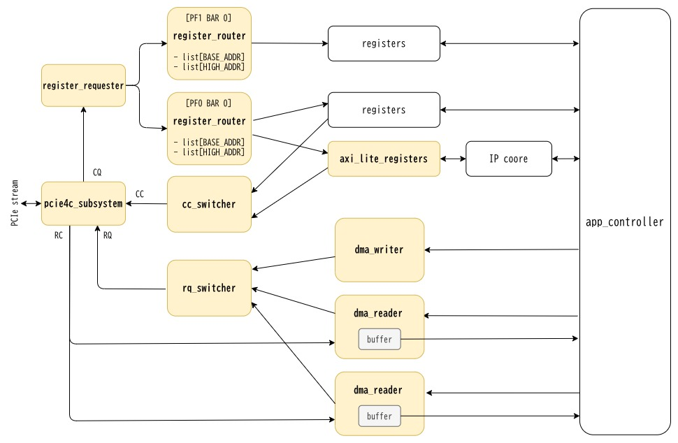

# PCIe Subsystem for AMD Xilinx

SystemVerilog modules for PCIe TLP control and DMA transfer using AMD Xilinx's UltraScale+™ Device Integrated Block for PCI Express® (pcie4c_uscale_plus ip).
This project provides a comprehensive PCIe subsystem implementation that enables direct Transaction Layer Packet (TLP) manipulation and DMA operations. It offers an alternative to XDMA, QDMA, and alexforencich/verilog-pcie.

**Key Features:**
- PCIe TLP control (RQ/RC/CQ/CC interfaces)
- DMA read/write engines optimized for large transfers
- Register access via PCIe Memory-Mapped I/O (MMIO)
- Modular architecture for easy integration
- Support for Straddle mode (up to 4 TLPs per clock cycle)

## Architecture

## TODO

- [ ] Scatter-gather support for dma_reader
- [ ] Comprehensive testbenches
- [ ] Detailed documentation
- [ ] Performance benchmarks
- [ ] Interrupt support

## Requirements

- AMD Xilinx Vivado 2024.1.x or later
- UltraScale+ FPGA device
- pcie4c_uscale_plus ip (included in Vivado)

## Target Devices
- AMD Alveo U50, U250, U280, etc ...
- Other UltraScale+ FPGAs with PCIe Gen3/Gen4 support
- Sample: Alveo U50

- Tested:
    - Alveo: U50
    - Vivado: 2024.1.x and 2024.2.x
    - OS: Ubuntu 22.04 (kernel 5.15)
